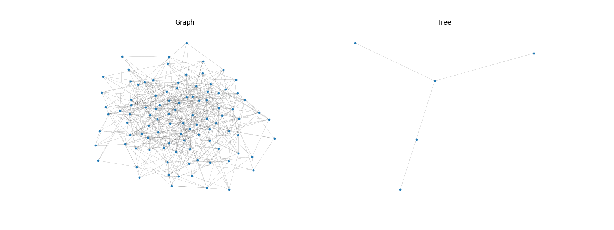
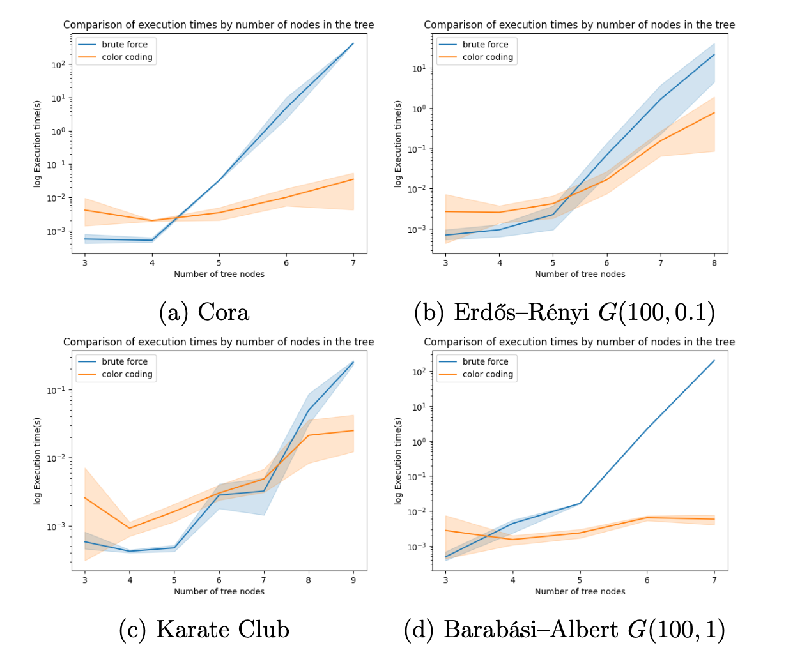

# Color coding
<p align="center">
  </img>
</p>

Implementation of a <a href="https://dl.acm.org/doi/pdf/10.1145/210332.210337">color coding</a> method for the problem of finding a subtree with k vertices in a given graph written in Python.

## Install

```bash
git clone https://github.com/mpiorczynski/color-coding.git
cd color-coding
pip install -r requirements.txt
export PYTHONPATH=.
```

## Usage
To test on a single instance:
```python
python src/main.py
```

To run a full benchmark: 
```python 
python src/graphs/generate_graphs.py
python src/tests/benchmark.py
```

### Benchmark results:
<p align="center">
  
</p>

## Citations

```bibtex
@inproceedings{alon-color,
    author = {Alon, Noga and Yuster, Raphael and Zwick, Uri},
    year = {1994},
    month = {01},
    pages = {326-335},
    title = {Color-coding: A new method for finding simple paths, cycles and other small subgraphs within large graphs},
    journal = {Proc. Symp. Theory of Computing (STOC)},
    doi = {10.1145/195058.195179}
}
```

```bibtex
@article{alon2008biomolecular,
  title={Biomolecular network motif counting and discovery by color coding},
  author={Alon, Noga and Dao, Phuong and Hajirasouliha, Iman and Hormozdiari, Fereydoun and Sahinalp, S Cenk},
  journal={Bioinformatics},
  volume={24},
  number={13},
  pages={i241--i249},
  year={2008},
  publisher={Oxford University Press}
}
```
